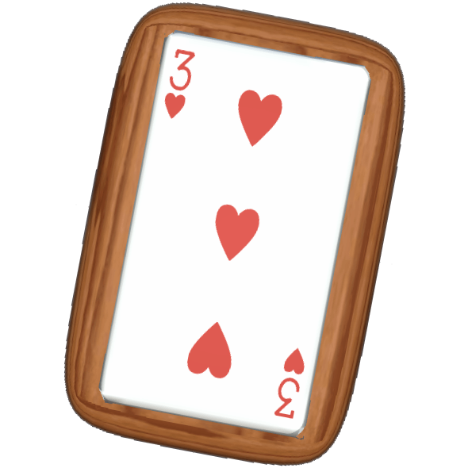

  

<h3 align="center">Mahjong</h3>

Mahjong Solitaire game made in Unity and coded from scratch

<a href="https://lhbelfanti.gitlab.io/mahjong/"><strong>➥ Live Demo</strong></a>

    
    
    

---
# Mahjong
Mahjong Solitaire game made in Unity and coded from scratch in 1 month and a half (approximately 10 hours per week).

## Preview

## Unity
It uses the following functionalities from Unity:
- 🌃 [UI](https://docs.unity3d.com/Manual/UIToolkits.html)
- 🎬 [Unity Animation System](https://docs.unity3d.com/Manual/AnimationOverview.html)
- 🔉 [Audio](https://docs.unity3d.com/Manual/Audio.html)
- 🧱 [Meshes, Materials, Shaders and Textures](https://docs.unity3d.com/Manual/Shaders.html)
- 🔠 [TextMesh Pro](https://docs.unity3d.com/Manual/com.unity.textmeshpro.html)
- ⚡️ [Shader Graph](https://unity.com/shader-graph)
- 🔆 Unity Editor: [Editor](https://docs.unity3d.com/ScriptReference/Editor.html), [EditorWindow](https://docs.unity3d.com/ScriptReference/EditorWindow.html), [EditorGUI](https://docs.unity3d.com/ScriptReference/EditorGUI.html) and [EditorGUILayout](https://docs.unity3d.com/ScriptReference/EditorGUILayout.html)

### External packages
- ｝[JsonDotNet](https://assetstore.unity.com/packages/tools/input-management/json-net-for-unity-11347) - To export the jsons with a specific indentation to be more readable
- 🔊 [Universal Sound FX](https://assetstore.unity.com/packages/audio/sound-fx/universal-sound-fx-17256)
- 🎵 [Free Music Tracks For Games](https://assetstore.unity.com/packages/audio/music/free-music-tracks-for-games-156413)

## Game
This is an implementation of the game 🀄️[Mahjong Solitaire](https://en.wikipedia.org/wiki/Mahjong_solitaire), made from scratch. It uses the Poker cards instead of the Mahjong tiles, just to make it a bit different.

### How to play
The objective of the game is to remove all pairs of tiles from the board. The user will lose when there are not exposed pairs remaining. A tile is said to be open or exposed if it can be moved either left or right without disturbing other tiles. The user has to match open pairs of identical tiles and remove them from the board, exposing the tiles under them for play.

### Scenes
The project contains 3 scenes:
- The **Main** scene: where the user can select a level to play, can change the audio settings and can quit the game.
- The **Game** scene: where the game takes place.
- The **Editor** scene: where the levels can be created, validated, tested and exported. It also has a section where created levels can be imported to be modified. [📚 Documentation](Assets/Scripts/Editor/README.md)

---
## License

[MIT](https://choosealicense.com/licenses/mit/)